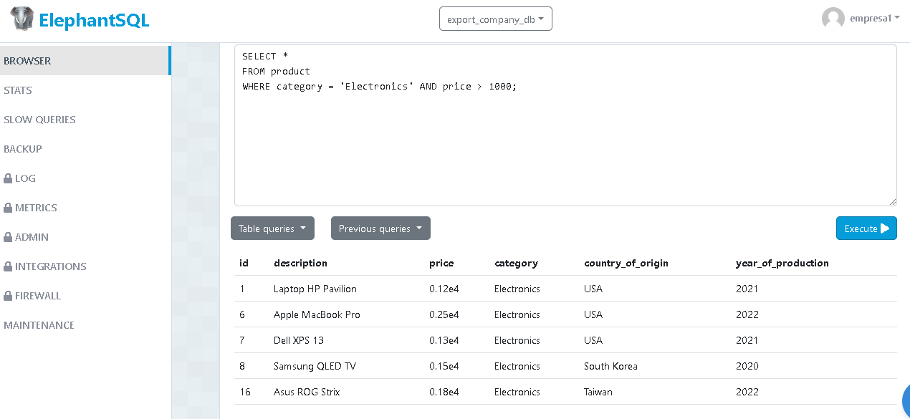
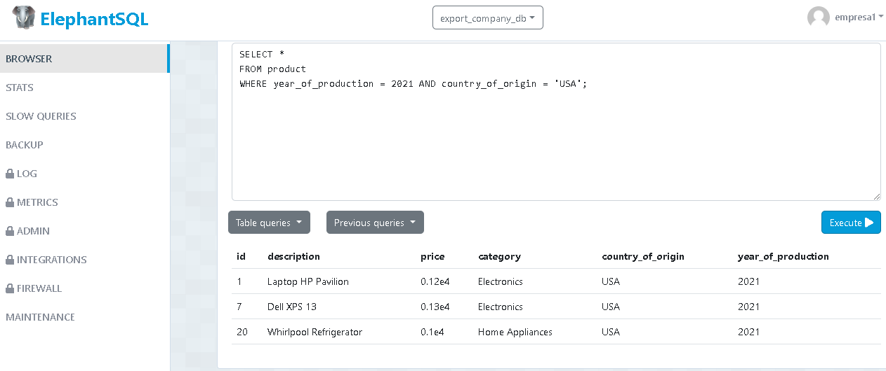
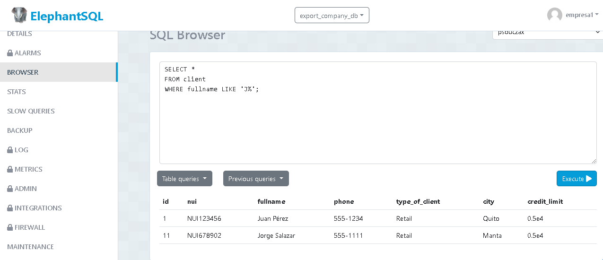
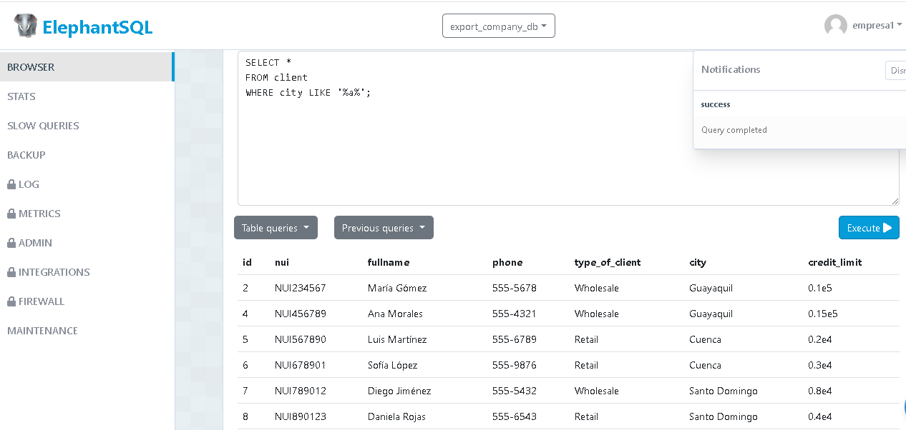

Contar el número de productos de una categoría específica.
  - Sentencia:
 SELECT COUNT(*) AS product_count
FROM product
WHERE category = 'Electronics';

 1000;
<img src="" 

Seleccionar productos que fueron producidos en un año específico y en un país de origen específico
- Sentencia:
SELECT *
FROM product
WHERE year_of_production = 2021 AND country_of_origin = 'USA';
<img src="" 

Seleccionar clientes cuyo nombre completo comience con 'J'.
- Sentencia:
SELECT *
FROM client
WHERE fullname LIKE 'J%';
<img src="" 

Seleccionar clientes cuya ciudad contenga la letra 'a'
- Sentencia:
SELECT *
FROM client
WHERE city LIKE '%a%';
<img src="" 

